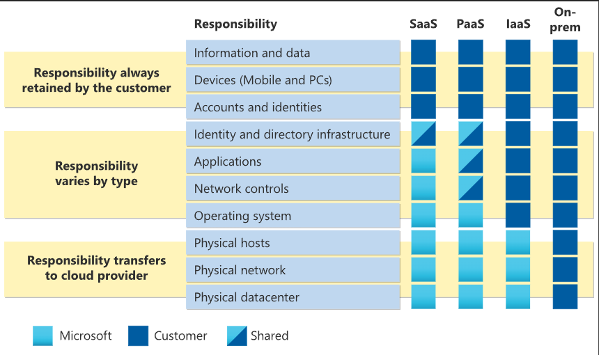

# Base Concepts
## Shared Responsibility Model

## Cloud models
- **Public Cloud**: Services offered over the public internet and available to anyone who wants to purchase them.
- **Private Cloud**: Cloud infrastructure operated solely for a single organization, providing greater control and security.
- **Hybrid Cloud**: A combination of public and private clouds, allowing data and applications to be shared between them.

- **Multi-Cloud**: The use of multiple cloud computing services in a single architecture, often to enhance redundancy and avoid vendor lock-in.
- **Azure Arc**: A set of technologies to manage and govern resources across on-premises, multi-cloud, and edge environments.
- **Azure VMware Solution**: A service that allows you to run VMware workloads natively on Azure.
  - VMMware workloads are virtualized applications and services that run on VMware's cloud infrastructure.

## Consumption-based Model
- **Capital Expenditure (CapEx)**: Upfront costs for purchasing hardware and software.
- **Operational Expenditure (OpEx)**: Ongoing costs for using cloud services, typically based on consumption.
- **Pay-as-you-go**: A pricing model where users pay only for the resources they consume, without upfront costs.
